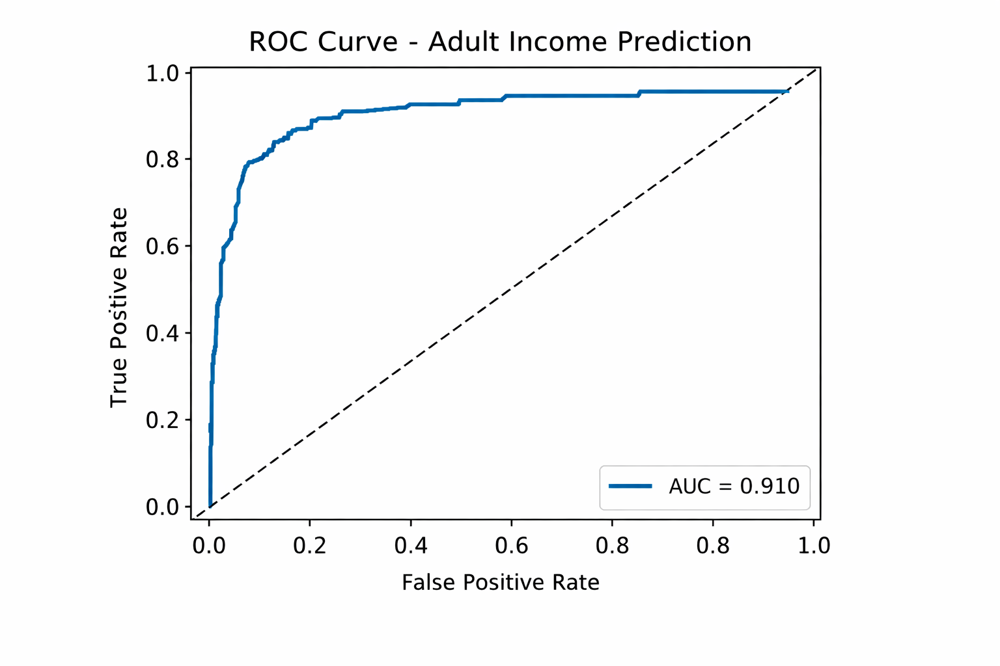

# 💰 Income Prediction using Machine Learning

## 🚀 Project Summary

This project predicts whether a person earns more than $50K per year using real-world demographic and employment data (UCI Adult Dataset).

The objective was to build a complete end-to-end ML pipeline — from raw data cleaning to model optimization and performance tuning.

This project demonstrates practical machine learning skills relevant to real-world business problems such as credit scoring, HR analytics, and customer segmentation.

---

## 🎯 Business Problem

Many companies need to identify high-income individuals for:
- Credit risk assessment
- Targeted marketing
- Financial planning
- Talent analysis

The goal is to accurately classify individuals earning >50K annually.

---

## 📊 Dataset

- 32,561 original records
- 30,162 after cleaning
- Mixed numerical and categorical features
- Imbalanced target (~24% >50K)

Hidden missing values ("?") were detected and removed.

---

## 🧠 Approach

### 1️⃣ Data Preprocessing
- Cleaned hidden missing values
- One-hot encoding for categorical variables
- Stratified train/test split

### 2️⃣ Model Development
Models evaluated:
- Logistic Regression
- Random Forest
- Gradient Boosting

### 3️⃣ Optimization
- Hyperparameter tuning (GridSearchCV)
- Cross-validation
- Feature importance analysis
- Ablation study
- Threshold tuning

---

## 📈 Final Model Performance

**Model:** Gradient Boosting  
**ROC-AUC:** ~0.91  

**Accuracy:** ~0.85  
**F1-score (>50K):** ~0.70  

Threshold tuning (0.5 → 0.35) improved minority class performance by ~7%.

---

## 🔍 Key Insights

- Capital gain and marital status strongly influence income prediction.
- Removing financial-related features reduces model performance significantly.
- Threshold optimization plays a critical role in imbalanced classification problems.
- Gradient Boosting performs best on structured tabular data.

---

## 🛠 Tech Stack

- Python
- Pandas
- NumPy
- Scikit-learn
- Matplotlib
- Jupyter Notebook

---

## 📁 Project Structure

---

## 👤 About Me

Dias Zhorhabayev  
Aspiring Machine Learning Engineer  

Focused on building practical ML solutions with clear business value.
